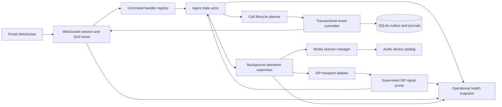

# SIP Windows Agent comprehensive improvement plan

วันที่จัดทำ: 09/10/2026  
ฐานการตรวจ: `150241ee0f85` (`refactor: harden audio device enumeration and caching in SipRuntime`)  
สถานะ: **Mandatory source remediation implemented — full architecture/Windows/PBX/performance DoD pending**

## บทสรุปและการตัดสินใจ

SIP Windows Agent มีพื้นฐานที่เหมาะสมสำหรับระบบ production ได้แก่ bounded single-writer coordinator,
correlated SIP call handle และ generation, strict protocol validation, durable event outbox,
active-call recovery journal, idempotent command journal, bounded logging และ cached storage/audio state.
โครงสร้างเหล่านี้ต้องคงไว้ระหว่างการปรับปรุง ไม่ควรรื้อเป็น shared mutable services หรือเพิ่ม parallelism
ใน call state และ SQLite โดยไม่มีหลักฐานจาก benchmark.

การตรวจรอบ 09/10/2026 พบ release blocker ใน source เพิ่มเติมสามกลุ่ม:

1. SIP signal pump เป็น fail-stop แต่ process ยังรันต่อ ทำให้ Agent อยู่ในสถานะ half-alive หลัง signal เดียวล้ม
2. WebSocket transport failure ระหว่าง replay อาจถูกจำแนกเป็น `outbox_unavailable` และทำให้ Agent degraded จนต้อง restart
3. call lifecycle transition ที่ต้องสร้างหลาย durable events ยัง commit แยก transaction และเกิด half-committed lifecycle ได้

แผนนี้รวมงาน correctness, availability, architecture, performance, observability, security residual,
automated tests, Windows/PBX evidence, rollout และ rollback ไว้ใน implementation program เดียว
ไม่ต้องสร้างแผน hardening รอบใหม่ก่อนลงมือ เว้นแต่ scope ภายนอกเปลี่ยน เช่น Protocol V2, multi-call,
multi-tenant local Agent หรือการเปลี่ยนนโยบาย security ที่ owner เคยยอมรับ.

ห้ามประกาศ production ready จนกว่า mandatory workstreams และ release gates ในเอกสารนี้ผ่านทั้งหมด
หรือมี risk acceptance ที่ระบุ owner, ผลกระทบ, compensating control และวันหมดอายุอย่างชัดเจน.

## ขอบเขตและหลักฐานปัจจุบัน

การตรวจครอบคลุมส่วนต่อไปนี้:

- coordinator queue, SIP signal pump, call and registration state transitions
- SIPSorcery callbacks, media lifecycle, audio inventory และ background task ownership
- local WSS session, replay ordering, backpressure, disconnect และ command dispatch
- SQLite durable events, active-call journal, command journal, checkpoint และ capacity policy
- tray, diagnostics, logging, shutdown และ process lifetime
- build, tests, dependency verification, performance sampler และ production evidence

ผลตรวจอัตโนมัติจาก implementation ปัจจุบัน (09/10/2026):

| Check | Result |
| --- | --- |
| Release cross-build | PASS, 0 warnings, 0 errors |
| Locked restore | PASS ด้วย `--locked-mode`; ไม่มี `NU1510` |
| Core tests | PASS, 92/92 |
| Windows host tests | Compile PASS; execution requires Windows Desktop runtime |
| Atomic rollback fault injection | PASS; insert ตัวที่สองล้มแล้วไม่มี event/journal ค้าง |
| Signal-pump continuation regression | PASS; terminal signal ถัดไปยังถูกประมวลผล |
| Transport-after-commit regression | PASS; durable eventsคงอยู่และ Agentไม่ถูก mark เป็น storage failure |
| Formatting/diff whitespace | PASS แยกตาม project; `git diff --check` PASS |
| NuGet vulnerability query on macOS | SDK error `Sequence contains no matching element`; Windows verifier remains authoritative |
| Windows/PBX/device/soak evidence | Pending ตาม checklists เดิม |

ผล build และ unit tests ไม่หักล้าง failure modes ที่ต้องอาศัย fault injection, socket disconnect,
Windows audio device, real PBX หรือ process crash ดังนั้นสถานะยังเป็น release evidence pending.

รายละเอียดไฟล์ที่เปลี่ยน, behavior, test evidence และ residual gates อยู่ที่
[comprehensive improvement implementation result](plan-results/2026-10-09-sip-agent-comprehensive-improvement-result.md).

เอกสารที่ใช้ร่วมกับแผนนี้:

- [Production readiness review](2026-10-06-sip-windows-agent-production-readiness-review.md)
- [Meticulous hardening result](plan-results/2026-10-07-sip-agent-meticulous-hardening-result.md)
- [Windows and PBX soak checklist](manual-verification/p2-windows-pbx-soak.md)
- [Windows performance result template](manual-verification/p5d-windows-performance-result-template.md)
- [Windows automated verifier](../scripts/verify-p2-windows.ps1)

## เป้าหมายและข้อจำกัด

### เป้าหมาย

- SIP callback หนึ่งรายการล้มแล้วต้องไม่ทำให้ signal processing หยุดโดยไม่มี controlled response
- transport disconnect ต้องไม่เปลี่ยน health ของ durable store
- call transition เชิงธุรกิจหนึ่งครั้งต้อง persist durable events และ journal state แบบ atomic
- background task ทุกตัวต้องมี owner, cancellation, fault observation และ bounded shutdown
- durable/control traffic ต้องไม่ถูก realtime traffic แย่ง capacity จนสูญเสีย session โดยไม่ observable
- command schema, validation, canonicalization และ execution ต้องมี source of truth เดียว
- maintenance, logger และ diagnostics failure ต้องไม่รบกวน call-control path
- performance optimization ต้องรักษา durability, privacy, event ordering และ idempotency
- production evidence ต้อง reproducible และผูกกับ commit กับ artifact checksum เดียวกัน

### ข้อจำกัดที่ต้องรักษา

- Protocol V1, message names, event ordering และ contiguous ACK contract ต้องไม่เปลี่ยนใน mandatory phases
- รองรับ Windows 10 1809+ x64 ตาม target ปัจจุบัน
- SQLite ต้องคง `journal_mode=WAL`, `synchronous=FULL`, `secure_delete=ON`
- คง one active call, one Portal owner และ single mutable state owner
- ห้าม retry side effect ที่อาจ dial, answer, reject, hangup หรือส่ง DTMF ซ้ำโดยอัตโนมัติ
- log, metric, diagnostics และ test evidence ต้องไม่มี credential, phone number, raw Origin, SDP,
  SIP header, DTMF, call ID หรือ command ID
- mandatory implementation ต้องไม่ bump SQLite schema เพื่อรักษา binary rollback; optional DDL ต้องผ่าน
  migration decision และ rollback rehearsal แยกก่อนนำเข้า release

### งานที่ไม่รวมโดยอัตโนมัติ

- Protocol V2 หรือ breaking change กับ Portal
- multi-call, conference, transfer, hold หรือ multi-account registration
- เปลี่ยน PBX/provider policy
- ยกเลิก approved exceptions เรื่อง unauthenticated allow-all WSS, plaintext SQLite/WAL,
  unsigned artifact หรือ full-target rollout โดยไม่มี canary

ข้อยกเว้นเหล่านี้ยังเป็น residual risk และต้องมี owner sign-off; การไม่แก้ในแผนนี้ไม่ถือว่าความเสี่ยงหายไป.

## Invariants ที่ implementation ต้องรักษา

1. Coordinator เป็นผู้แก้ Agent, registration และ call state เพียงตัวเดียว
2. External SIP, media, socket และ filesystem I/O ห้ามรอขณะถือ coordinator state execution นานเกินจำเป็น
3. ทุก SIP signal ต้องผูก generation และ call handle ก่อนกระทบ call state
4. durable event ต้อง commit ก่อน publish และ ACK ห้ามข้าม missing sequence
5. command ID เดิมกับ canonical payload เดิมต้องคืนผลเดิมโดยไม่ execute side effect ซ้ำ
6. command ID เดิมกับ payload ต่างกันต้องคืน `command_duplicate_conflict`
7. terminal transition ต้องสร้าง lifecycle ที่ครบและมี terminal outcome เพียงครั้งเดียว
8. shutdown ต้องหยุดรับงานใหม่, cancel owned operations, persist terminal stateเท่าที่ทำได้ และจบภายใน budget
9. queue overflow, task fault, persistence failure และ transport failure ต้อง observable และมี deterministic policy
10. performance optimization ห้ามลด durability หรือเปลี่ยน failure semantics เพื่อให้ benchmark ดีขึ้น

## รายการ finding และลำดับความสำคัญ

- P0 หมายถึง defect ที่หยุด call control, ทำให้ process half-alive หรือจำแนก health ผิดจนต้อง restart
- P1 หมายถึง defect ที่กระทบ lifecycle correctness, durability, shutdown หรือ availability อย่างมีนัยสำคัญ
- P2 หมายถึง hardening ด้าน architecture, performance, observability และ maintainability ที่ต้องปิดก่อน production complete

| ID | Priority | Finding | Production impact | Required disposition |
| --- | --- | --- | --- | --- |
| SIP-NEXT-001 | P0 | SIP signal pump rethrow แล้วหยุดอ่าน channel | call/registration callbacks หลังจากนั้นหาย แต่ process ยังดูเหมือนทำงาน | แก้ก่อน release |
| SIP-NEXT-002 | P0 | replay รวม store และ socket exception เป็น `outbox_unavailable` | disconnect ปกติอาจ block สายใหม่จน restart | แก้ก่อน release |
| SIP-NEXT-003 | P1 | multi-event call transition commit แยก transaction | lifecycle ไม่ครบและ recovery ต้องรอ restart | แก้ก่อน release |
| SIP-NEXT-004 | P1 | background operations ไม่มี supervisor กลาง | task fault/race ตอน shutdown และ cleanup ไม่ครบ | แก้ก่อน release |
| SIP-NEXT-005 | P1 | lifetime cancellation ถูก map เป็น business/runtime failure ได้ | shutdown ส่งผลลัพธ์ผิดและสร้าง cleanup ซ้ำ | แก้ก่อน release |
| SIP-NEXT-006 | P1 | durable, control และ realtime ใช้ outbound capacity เดียว | low-value traffic ทำให้ session abort และ health แสดงคลาดเคลื่อน | แก้ก่อน rollout วงกว้าง |
| SIP-NEXT-007 | P2 | command definition กระจายหลาย switch และ validation ซ้ำ | capability/validation/fingerprint drift เมื่อเพิ่ม command | ปิดใน architecture phase |
| SIP-NEXT-008 | P2 | command prune อยู่บน request path และกลืน exception | latency spike และ journal maintenance failure ไม่ observable | ปิดใน architecture phase |
| SIP-NEXT-009 | P2 | logger และ tray diagnostics ยังมี synchronous failure surface | logging/device API อาจรบกวน call-control หรือ UI | ปิดก่อน production complete |
| SIP-NEXT-010 | P2 | coordinator, runtime และ store มีหลาย responsibility | แก้ไขยากและ regression surface ใหญ่ | refactor แบบรักษา state owner |
| SIP-NEXT-011 | P2 | metrics ไม่มี operational health snapshot ครบ | half-alive pump, queue pressure และ task fault ตรวจพบช้า | เพิ่มใน observability phase |
| SIP-NEXT-012 | P2 | persistence/query optimization ยังไม่มี Windows baseline ครบ | อาจ optimize ผิดจุดหรือเพิ่ม migration risk | benchmark ก่อน DDL/parallelism |

P0 และ P1 ในตารางเป็น mandatory source gate. P2 ที่เกี่ยวกับ verification, shutdown, observability,
privacy หรือ release assurance เป็น production-complete gate แม้ไม่ block developer build.

### Source evidence

| Finding | Evidence |
| --- | --- |
| SIP-NEXT-001 | [`PumpSipSignalsAsync` rethrows per-signal failure](../src/DebtFlow.SipAgent.Application/AgentCoordinator.cs#L998) และ [`DisposeAsync` does not absorb a faulted pump](../src/DebtFlow.SipAgent.Application/AgentCoordinator.cs#L272) |
| SIP-NEXT-002 | [`ReplayPendingEventsAsync` maps every non-cancellation failure to outbox](../Host/LocalWebSocketServer.cs#L220) ขณะที่ [`SendReplayPageAsync` uses the WebSocket session](../Host/WebSocketEventPublisher.cs#L64) |
| SIP-NEXT-003 | [`EndCallCoreAsync` writes state and ended events separately](../src/DebtFlow.SipAgent.Application/AgentCoordinator.cs#L1213) และ [`AppendInternalAsync` opens one transaction per event](../src/DebtFlow.SipAgent.Persistence/SqliteAgentEventStore.cs#L575) |
| SIP-NEXT-004 | [`StartCallCoreAsync` launches an untracked outbound task](../src/DebtFlow.SipAgent.Application/AgentCoordinator.cs#L450) และ [`SipRuntime.TrackBackground` only removes completion](../Host/SipRuntime.cs#L1621) |
| SIP-NEXT-005 | [runtime and audio operation exception mapping](../src/DebtFlow.SipAgent.Application/AgentCoordinator.cs#L730) |
| SIP-NEXT-006 | [`WebSocketEventPublisher.SendAsync` shares one queue and returns completed after abort for non-wait messages](../Host/WebSocketEventPublisher.cs#L120) |
| SIP-NEXT-007 | [execution switch](../Host/V1CommandDispatcher.cs#L219) และ [canonicalization switch](../Host/V1CommandDispatcher.cs#L340) |
| SIP-NEXT-008 | [`MaybePruneCommandsAsync` runs from dispatch and suppresses failure](../Host/V1CommandDispatcher.cs#L482) |
| SIP-NEXT-009 | [logger serialization on caller](../Host/SafeJsonLoggerProvider.cs#L67) และ [direct WinMM access from diagnostics](../Host/TrayApplicationContext.cs#L325) |
| SIP-NEXT-010 | large ownership surfaces in [AgentCoordinator](../src/DebtFlow.SipAgent.Application/AgentCoordinator.cs), [SipRuntime](../Host/SipRuntime.cs) และ [SqliteAgentEventStore](../src/DebtFlow.SipAgent.Persistence/SqliteAgentEventStore.cs) |
| SIP-NEXT-011 | [current performance instruments](../src/DebtFlow.SipAgent.Application/AgentPerformanceTelemetry.cs) do not expose pump/task/queue lifecycle health |
| SIP-NEXT-012 | [current performance evidence template](manual-verification/p5d-windows-performance-result-template.md) still requires Windows baseline, replay and soak measurements |

## Target architecture และ design patterns

### Pattern และหน้าที่

| Pattern | ใช้กับ | เหตุผล |
| --- | --- | --- |
| Actor or single writer | Agent, registration และ call state | รักษา ordering และตัด shared-state race |
| Supervisor and structured concurrency | SIP/media/background operations | ทุก task มี owner, cancellation และ fault policy |
| Transactional outbox and unit of work | call transition event batch + journal | ป้องกัน half-commit โดยไม่ลด SQLite durability |
| Strategy and command handler registry | protocol commands | รวม deserialize, validate, canonicalize และ execute |
| Ports and adapters | SIP, audio, SQLite, WebSocket | แยก domain policy ออกจาก Windows และ library implementation |
| Bulkhead and priority queue | outbound WebSocket traffic | กัน durable/control capacity ออกจาก realtime burst |
| Typed fault taxonomy | store, transport, protocol, timeout, shutdown | ป้องกันการ mark degraded ผิด failure domain |
| Immutable snapshots | audio, storage, operational health | ทำ read path เร็วและไม่เพิ่ม lock contention |

การแยก class ต้องไม่สร้าง mutable state owner หลายตัว. `AgentStateActor` ยังคงเป็น authority;
services อื่นคืน intent, result หรือ immutable snapshot เท่านั้น.

## Workstream A SIP signal supervision

### Target design

เปลี่ยน `PumpSipSignalsAsync` จาก fail-stop loop เป็น supervised consumer ที่ประมวลผลแต่ละ signal ผ่าน
`ProcessSipSignalAsync`. ผลลัพธ์ต้องจำแนกเป็น success, stale, recoverable failure และ fatal infrastructure failure.
ห้ามกลืน exceptionแล้วทำงานต่อโดยไม่มี state transition และห้ามปล่อย task faultโดย processยังรับ commandต่อ.

### Required changes

- เพิ่ม typed classification เช่น `AgentFaultDomain` และ `AgentFaultSeverity`
- แยก exception handling ต่อ signal ออกจาก lifetime ของ pump
- complete `ProcessingCompletion` ด้วยผลจริงทุก path
- store/capacity failure ต้อง stop registration และ block call ใหม่แบบ fail closed
- pump ต้องยังรับ cleanup/terminal signals หรือ trigger controlled application stop ตาม policy ที่ทดสอบแล้ว
- unexpected programming exception ต้อง log safe type, record metric และ trigger controlled process failure
- เพิ่ม pump state, last fault code และ overflow count ใน operational health snapshot
- `DisposeAsync` ต้อง observe faulted pump โดยไม่ข้าม SIP runtime cleanup

### Tests

- `SignalPump_FirstSignalStoreFailure_SubsequentCleanupIsHandled`
- `SignalPump_UnexpectedFault_TriggersControlledStop`
- `SignalPump_LifetimeCancellation_DoesNotEmitRuntimeError`
- `SignalPump_ProcessingCompletion_CompletesExactlyOnce`
- `SignalPump_Overflow_FailsClosedAndShutdownRemainsBounded`

### Acceptance criteria

- ไม่มี scenario ที่ pump task fault แล้ว listener, tray และ command endpoint ยังรายงาน Agent ปกติ
- terminal cleanup หลัง recoverable failure ไม่สูญหาย
- pump fault และ channel overflow มี bounded non-PII metric และ diagnostic state
- shutdown หลัง fault จบภายใน 10 วินาทีและไม่โยน unobserved exception

## Workstream B WebSocket replay และ failure isolation

### Target design

แยก replay ออกเป็น store page load, transport enqueue และ delivery barrier ที่มี exception boundary คนละชั้น.
เฉพาะ store exception เท่านั้นที่เปลี่ยน durable-store health. Socket close, channel close และ delivery cancellation
ต้องจบ sessionแล้ว replay ใหม่จาก `LastAcknowledgedSequence` เมื่อ reconnect.

### Required changes

- แยก `LoadReplayPageAsync` และ `SendReplayPageAsync` error handling
- เพิ่ม typed `WebSocketDeliveryException` หรือ result type ที่ไม่ปะปนกับ `AgentStoreException`
- bind replay operation กับ session identity/generation เพื่อไม่ enqueue เข้า stale session
- normal close, timeout, application shutdown และ protocol violation ต้องมี close reason ต่างกัน
- transport failure ห้ามเรียก `MarkDegradedAsync("outbox_unavailable")`
- store health recovery ต้องมี explicit probe; ห้ามให้ reconnect เพียงอย่างเดียวเปลี่ยน store health
- session attach/detach และ `IsConnected` ต้องอ้างอิง lifecycle source เดียว

### Tests

- disconnect ก่อน replay page, กลาง page และที่ last delivery barrier
- reconnect หลัง disconnect และ replay ต่อจาก ACK โดยไม่ duplicate acknowledged sequence
- SQLite load failure mark degraded แต่ WebSocket send failureไม่ mark store degraded
- stale session generation ไม่รับ replay/live events ของ session ใหม่
- client close ถูกจำแนกเป็น normal disconnect ไม่ใช่ timeout

### Acceptance criteria

- socket-loss fault injection ทุกตำแหน่งไม่เปลี่ยน Agent เป็น `outbox_unavailable`
- reconnect ส่ง event ordered and complete โดยไม่มี gap หรือ acknowledged duplicate
- genuine store failure ยังคง fail closed และ block call ใหม่

## Workstream C Atomic call lifecycle persistence

### Target design

สร้าง call transition plan แบบ immutable ที่มี resulting state, durable event drafts และ terminal flag.
commit event drafts ทั้งชุดพร้อม active-call journal mutation ใน SQLite transaction เดียว แล้วจึง publish
ตาม sequence ที่ commit สำเร็จ.

### Required changes

- เพิ่ม `CallTransitionPlan` และ pure planner จาก current state + signal
- เพิ่ม `AppendCallTransitionAsync` ใน `IAgentEventStore`
- SQLite implementation insert events ตามลำดับและ upsert/delete journal ใน transaction เดียว
- update in-memory authoritative state หลัง commit สำเร็จ หรือ rollback deterministically เมื่อ commit ล้ม
- start transition ต้อง batch `call.created` + initial `call.state_changed`
- terminal transition ต้อง batch terminal `call.state_changed` + `call.ended`
- publish หลัง commit; publisher failureไม่ rollback durable transaction
- preserve existing event names, payload, sequence และ ACK semantics

### Tests

- fault ก่อน transaction, ระหว่าง event inserts, ก่อน journal mutation และก่อน commit
- publisher failure หลัง commit แล้ว reconnect replay ส่ง events ครบ
- process restart หลังทุก fault point ให้ terminal outcome เพียงหนึ่งครั้ง
- outbound/inbound start failure ไม่มี orphan lifecycle
- concurrent/stale terminal signals ไม่สร้าง double terminal

### Acceptance criteria

- transition ทั้งชุดปรากฏครบหรือไม่ปรากฏเลย
- active-call journal ตรงกับ durable sequence ล่าสุดเสมอ
- protocol payload และ event ordering เดิมไม่เปลี่ยน
- SQLite `synchronous=FULL` และ contiguous ACK invariant ยังผ่าน
- transaction batching ลด commit count โดยไม่เพิ่ม event loss window

## Workstream D Background operations และ shutdown

### Target design

เพิ่ม `IBackgroundOperationSupervisor` สำหรับ outbound call, registration stabilization/retry,
owner lease, audio refresh, media cleanup และ overflow reporting. Supervisor ต้อง register task ก่อนเริ่ม,
observe completion/fault, cancel ด้วย owned token และ drain ภายใน shutdown budget.

### Required changes

- ยกเลิก untracked fire-and-forget operations
- ทุก operation มี name ชนิด bounded, generation และ fault policy โดย metric ห้ามใส่ identifier
- task callback ที่เริ่มหลัง disposal ต้องถูก reject หรือ cancel
- เปลี่ยน `_disposed` และ cross-thread status เป็น `Interlocked`/`Volatile` หรือ immutable lifecycle state
- shutdown sequence: stop intake → cancel session/operations → hangup/unregister → commit/checkpoint → drain → dispose
- แต่ละ cleanup step ใช้ time budget ของตัวเองและ aggregate ภายใต้ 10 วินาที
- cleanup step หนึ่งล้มต้องไม่ข้ามขั้นตอนถัดไป

### Tests

- shutdown ขณะ outbound dialing, inbound answering, registration retry, audio test และ device refresh
- background task fault ถูก observe/log/metric เพียงครั้งเดียว
- callback มาหลัง disposal ไม่สร้าง task ใหม่
- faulted signal pump ไม่ข้าม runtime/store disposal
- repeated shutdown/dispose เป็น idempotent

### Acceptance criteria

- ไม่มี unobserved task exception
- process exit ≤10 วินาทีทุก fault-injection scenario
- ไม่มี callback เขียน channel/store หลัง owner ถูก dispose
- active call มี terminal persistence เท่าที่ durable store ยังใช้งานได้

## Workstream E Cancellation และ error taxonomy

### Failure policy

| Domain | Examples | Agent action | Client result |
| --- | --- | --- | --- |
| Request | client request canceledก่อน dequeue | ไม่ execute | request canceled |
| Timeout | SIP/audio operation เกิน operation budget | cleanup operation/call ตาม policy | stable timeout code |
| Application lifetime | tray exit, service stop | orderly shutdown | ไม่ map เป็น business failure |
| Transport | SIP/WebSocket disconnect | retry/reconnect ตาม subsystem | transport-safe code หรือ session close |
| Persistence | corrupt/full/unavailable SQLite | fail closed, stop new calls | stable outbox code |
| Protocol | invalid envelope/payload/state | reject command/session | stable protocol code |
| Programming defect | unexpected invariant/exception | controlled stop + safe diagnostics | internal error if delivery safe |

### Required changes

- รวม runtime/audio operation wrapper เป็น implementation เดียว
- ตรวจ lifetime cancellation ก่อน timeout/generic mapping ทุก path
- ไม่เรียก state-changing recovery หลัง lifetime ถูก cancel เว้นแต่เป็น bounded shutdown step
- ใช้ stable safe code; exception message ห้ามส่งออก protocol/log
- เพิ่ม table-driven tests ครบทุก domain และ operation type

### Acceptance criteria

- cancellation ชนิดเดียวกันได้ผลเหมือนกันใน answer/reject/hangup/DTMF/audio operations
- shutdown cancellation ไม่ถูกบันทึกเป็น `sip_runtime_error` หรือ `audio_control_failed`
- timeout ยัง cleanup call handle/media โดยไม่ double-terminal

## Workstream F WebSocket QoS และ backpressure

### Target design

ใช้ outbound lanes ที่มี priority และ bounded capacity:

1. control lane สำหรับ command result, error, welcome, snapshot และ pong
2. durable lane สำหรับ committed durable events และ replay
3. realtime lane สำหรับ replaceable state notifications

writer ยังคงเป็น single WebSocket writer และกำหนด fairness เพื่อไม่ starve durable หรือ control traffic.
realtime state ประเภทเดียวกันสามารถ coalesce เป็นค่าล่าสุดก่อนส่ง แต่ durable event ห้าม drop/coalesce/reorder.

### Required changes

- reserved capacity หรือ separate bounded channels ตาม lane
- queue-full policy ต่อ lane: durable/control fail session visibly; realtime coalesce/drop พร้อม metric
- `SendAsync` ห้ามคืน success แบบเงียบเมื่อ session ถูก abort
- expose queue depth, high-water mark, abort count และ dropped realtime count
- session writer fault ต้องเปลี่ยน connection health ทันที ไม่รอ receive loop timeout

### Tests

- realtime burst ไม่ขัดขวาง command result และ durable delivery
- durable queue pressure ทำ controlled disconnect/replay โดยไม่ event loss
- fairness test ยืนยัน controlไม่ starve replay และ replayยัง progress
- writer fault ทำ `IsConnected=false` ตาม lifecycle source เดียว

### Acceptance criteria

- durable/control message ไม่ drop โดยไม่มี exception/session transition
- realtime overflow ไม่ทำให้ Agent/store degraded
- queue memory มี hard bound และ diagnostic metrics ไม่มี identifiers

## Workstream G Command registry และ maintenance

### Target design

สร้าง immutable command descriptor ต่อ command type โดย descriptor เดียวกำหนด payload type, canonicalization,
validation, call scope, execution และ capability metadata. Dispatcher รับผิดชอบเฉพาะ envelope, idempotency,
journal state และ result mapping.

### Required changes

- แทน execution/canonicalization/call-scope switches ด้วย registry
- validation ทำครั้งเดียวก่อนสร้าง command journal row
- generate capability list จาก registry หรือเพิ่ม architecture test ยืนยัน parity
- ย้าย prune ออกจาก request latency path เป็น supervised maintenance operation
- prune failure ต้อง log/metric และ retryเร็วกว่ารอบปกติ
- รวม retention/hard-cap policy ใน options/value object เดียว

### Tests

- descriptor coverage สำหรับ capability ทุกตัว
- command type ใหม่ที่ขาด canonicalizer/handler ทำ build/test fail
- payload conflict และ exact replay ยังรักษา idempotency
- prune failure retry และไม่ block command execution
- command capacity ยัง fail closed

### Acceptance criteria

- command semantics มี source of truth เดียว
- ไม่มี duplicated command-type list ที่ต้องแก้พร้อมกันหลายจุด
- maintenance latency ไม่อยู่ใน p95 command response

## Workstream H Logging, diagnostics และ tray isolation

### Required changes

- logger `Write` มี top-level non-fatal isolation; sanitizer timeout/serialization failureเพิ่ม metricแล้ว drop safely
- ห้าม catch `OutOfMemoryException`, `StackOverflowException` หรือ process-fatal exception เพื่อทำงานต่อ
- logger queue depth/high-water mark และ dropped count อยู่ใน diagnostics แบบ non-PII
- diagnostics ใช้ cached `AudioDevices` หรือ bounded worker แทน WinMM enumeration บน UI thread
- tray async event handlers เรียก safe task wrapper ที่ catch/log และไม่ crash UI message loop
- `OpenLogDirectory`, shutdown และ certificate maintenance มี bounded error handling
- diagnostic ZIP เพิ่ม operational health snapshot แต่ไม่รวม DB/config/raw exception text

### Tests

- sanitizer fuzz/timeout และ malformed structured property ไม่ทำให้ caller โยน exception
- log directory denied/full/recovered ระหว่าง call control
- diagnostic export ขณะ audio API hang/fail ยังจบภายใน timeout
- tray exit ที่ coordinator โยน unexpected exception ยังออกหรือแสดง safe failure ตาม policy

### Acceptance criteria

- logging failure ไม่เปลี่ยน call state หรือ command result
- UI operation ไม่มี synchronous device enumeration ที่ unbounded
- diagnostics privacy tests ครอบคลุม health fields ใหม่

## Workstream I Component boundaries

### AgentCoordinator

คง actor queue และ state ownershipไว้ แต่แยก pure policy และ infrastructure orchestration:

- `CallLifecyclePlanner` สำหรับ state transition/event plan
- `RegistrationSupervisor` สำหรับ retry/stable reset/generation policy
- `AudioOperationPolicy` สำหรับ reservation และ timeout policy
- `AgentFaultPolicy` สำหรับ degraded/controlled-stop decision
- `DurableEventCommitter` สำหรับ transition commit/publish ordering

### SipRuntime

แยก responsibilities โดยไม่แจก mutable call state:

- `SipTransportAdapter` สำหรับ SIPSorcery transport/user agent callbacks
- `MediaSessionManager` สำหรับ endpoint, media session, cleanup และ remembered volume
- `AudioDeviceCatalog` สำหรับ enumeration, identity, cache, notification และ device tests
- `SipSignalSink` สำหรับ bounded signal emission และ overflow policy

### Persistence

คง serialized SQLite executor แต่แยก code organization:

- `SqliteSchemaMigrator`
- `DurableEventRepository`
- `ActiveCallJournalRepository`
- `CommandJournalRepository`
- `SqliteStorageHealthReader`

repository ย่อยต้องใช้ connection/transaction executor เดียวกัน ห้ามเปิด transaction ซ้อนหรือสร้าง
independent write connections โดยพลการ.

### Refactor rules

- behavior-preserving extraction ต้องมี characterization tests ก่อนย้าย
- ห้ามเปลี่ยน public protocol และ domain behaviorพร้อม file move โดยไม่มี focused regression
- ทุก phase ต้อง build/test ผ่าน; ห้ามสะสม refactorขนาดใหญ่โดยไม่มี runnable checkpoint
- class size ไม่ใช่ acceptance criterion โดยลำพัง; cohesion, ownership และ testability เป็นเกณฑ์หลัก

## Workstream J Persistence และ performance optimization

### Mandatory optimizations

- batch multi-event call transition ใน transaction เดียว
- ย้าย command prune ออกจาก request path
- หลีกเลี่ยง duplicate serialization และ file/device query บน coordinator/UI paths
- เพิ่ม queue/high-water and operation duration telemetry เพื่อชี้ bottleneck จริง

### Evidence-driven optimizations

- ตรวจ `EXPLAIN QUERY PLAN` ของ command prune ก่อนเพิ่ม `DurableEvents(CommandId)` index
- ตรวจ p95/p99 storage duration และ WAL growth ก่อนพิจารณา prepared-command reuse
- ห้ามเพิ่ม SQLite connection concurrency จนกว่าพิสูจน์ว่า `_gate` เป็น bottleneck และ busy contentionไม่เพิ่ม
- source-generated JSON ใช้เฉพาะเมื่อ allocation profileยืนยันว่า protocol serializationมีสัดส่วนสำคัญ
- ReadyToRun/single-file/trimming เปลี่ยนได้เมื่อ startup/package benchmark และ SIPSorcery/NAudio compatibility ผ่าน

### Proposed performance budgets

ใช้เครื่อง Windows, PBX, network path และ audio devices เดียวกันสำหรับ baseline กับ candidate:

| Metric | Acceptance budget |
| --- | --- |
| Coordinator queue wait | p95 ≤50 ms และ p99 ≤250 ms นอก intentional maintenance/shutdown |
| Tray snapshot | 30 samplesไม่มี timeout; p95 ≤250 ms |
| Replay 10,000 events | ordered/complete ภายใน 60 s บน localhost; peak private growth ≤64 MiB |
| Normal outbound control | candidate p95 ไม่ช้ากว่า baselineเกิน 10% |
| Normal inbound answer | candidate p95 ไม่ช้ากว่า baselineเกิน 10% |
| Idle registered 15 min | ไม่มี monotonic handle/thread/private-byte growth |
| 2-hour/50-call soak | end handles/threadsไม่เกิน baselineหลัง warm-up +5; ไม่มี sustained private-byte slope |
| Shutdown | ≤10 s ทุก required scenario |
| Normal logger operation | dropped records = 0, writer failures = 0 |

หาก hardware/PBX ทำให้ absolute budget ใช้ไม่ได้ ต้องบันทึก baseline, สาเหตุ, candidate delta และ owner-approved
budget ใหม่ก่อน release; ห้ามเปลี่ยน thresholdย้อนหลังเพื่อให้ผลที่ล้มกลายเป็นผ่าน.

## Workstream K Observability และ operational health

เพิ่ม immutable operational health snapshot สำหรับ tray และ diagnostics โดยไม่เพิ่ม PII:

- signal pump state, last bounded fault code และ overflow count
- coordinator queue approximate depth/high-water mark
- background operation count และ fault countตาม bounded operation type
- WebSocket session generation/state และ queue high-water markตาม lane
- replay count/duration และ last completed replay sequence
- command maintenance last success/failure time และ bounded error code
- logger queue high-water, dropped records และ writer failures
- storage state, pending count, oldest age, DB+WAL bytes และ checkpoint age

health snapshot ใช้สำหรับ local diagnostics และ support; ไม่ควรเพิ่ม remote command หรือ expose raw exception
โดยอัตโนมัติ. Metric tags ต้องใช้ bounded enum/code เท่านั้นเพื่อป้องกัน cardinality และ privacy leak.

Operational alerts และ kill switch:

- pump not running ขณะ application lifetime active
- durable/control queue overflowแม้หนึ่งครั้ง
- duplicate dial, double terminal หรือ sequence gapแม้หนึ่งครั้ง
- pending event age >300 วินาที หรือ storage critical/full
- shutdown >10 วินาที
- private memory, handles หรือ threads เพิ่มต่อเนื่องใน soak
- log/diagnostic PII leakแม้หนึ่งรายการ

เหตุใดเหตุหนึ่งเกิดขึ้นต้องหยุด rollout และหยุดเปิดสายใหม่ใน scope ที่ได้รับผลกระทบโดยไม่ล้าง DB หรือ force ACK.

## Automated test plan

### Core tests

- transition planner exhaustive state/signal matrix
- event batch atomicity และ journal invariants
- signal supervisor fault matrix
- cancellation/error mapping table
- command registry completeness/idempotency
- storage capacity, ACK gap และ restart recovery

### Windows host tests

- WebSocket replay disconnect matrix และ QoS saturation
- logger failure/sanitizer isolation
- tray safe task wrapper และ bounded diagnostics
- audio catalog notification/cache/device test lifecycle
- runtime disposal/background task supervision
- TLS, origin, one-owner และ rate/message-size regressions

### Integration and chaos tests

| ID | Scenario | Required result |
| --- | --- | --- |
| NEXT-CHAOS-01 | store append fails on first SIP signal | fail closed; pump policy deterministic; cleanupยังทำงาน |
| NEXT-CHAOS-02 | fail between terminal event drafts | transaction rollback; no partial lifecycle |
| NEXT-CHAOS-03 | socket closes on final replay send | session disconnect; store health unchanged |
| NEXT-CHAOS-04 | realtime burst during 10k replay | durable/control ordered; bounded memory |
| NEXT-CHAOS-05 | shutdown during answer callback | ≤10 s; no deadlock/double terminal |
| NEXT-CHAOS-06 | audio device removed during call and refresh | degraded signal; call cleanup and next-call recovery |
| NEXT-CHAOS-07 | log directory denied then restored | call control responsive; pending log recovery bounded |
| NEXT-CHAOS-08 | DB full/read-only/corrupt | stable safe code; registration/new calls fail closed |
| NEXT-CHAOS-09 | process killed after command side effect | retryไม่ execute side effectซ้ำ; outcome unknown/abandonedตาม contract |
| NEXT-CHAOS-10 | callbacks arrive after runtime dispose starts | ignored/canceled; no new background task or channel write |

ทุก regression test ต้อง deterministic, ใช้ injectable fault point หรือ fake adapter แทน timing-only sleep เมื่อทำได้.

## Windows, PBX และ device acceptance matrix

ต้องรัน automated Windows verifier และ checklists เดิม พร้อมเพิ่มรายการต่อไปนี้:

- UDP/TCP registration, auth failure, retry, reconfigure และ unregister race
- inbound/outbound answer, reject, cancel, remote hangup, missing ACK และ repeated terminal callback
- socket loss ก่อน/ระหว่าง/หลัง replay page รวม 250, 1,000 และ 10,000 events
- default/explicit/duplicate-label/Bluetooth capture and playback device
- unplug/return ระหว่าง idle, audio test, dialing, answering และ connected call
- direct/NAT/symmetric RTP ตาม `AcceptRtpFromAny` policy
- DB full/read-only/corrupt, WAL checkpoint และ restart recovery
- log disk denial/full/recovery และ safe diagnostic export
- tray exit, Windows session ending และ process restart ระหว่างทุก owned operation
- 2 ชั่วโมงและอย่างน้อย 50 sequential completed call cycles

evidence ทุกชุดต้องมี commit, artifact SHA-256, Windows build, PBX/network, device identityแบบไม่เปิด PII,
tester, timestamp และผล PASS/FAIL ต่อ scenario.

## Implementation sequence และ dependency

### Phase 0 Characterization and guardrails

1. เพิ่ม failing regression tests สำหรับ SIP-NEXT-001 ถึง SIP-NEXT-006
2. เพิ่ม fault-injection adapters และ operational health test surface
3. เก็บ Windows baseline ของ build, tests, control latency, replay และ resource usage

Exit criteria: tests reproduce failure อย่าง deterministic และ baseline evidence ผูกกับ commit.

### Phase 1 Correctness and availability blockers

1. Workstream A SIP signal supervision
2. Workstream B replay failure isolation
3. Workstream C atomic call lifecycle persistence
4. Workstream E cancellation/error taxonomy

Exit criteria: P0/P1 regression ผ่าน, Protocol V1/schema unchanged, build 0 warnings/errors.

### Phase 2 Lifecycle and backpressure

1. Workstream D background operation supervisor and shutdown
2. Workstream F WebSocket QoS lanes
3. Workstream H logger, diagnostics and tray isolation
4. Workstream K operational health fieldsที่จำเป็นต่อ fault evidence

Exit criteria: shutdown/socket/log/device fault testsผ่านและทุก queue/task มี owner/policy.

### Phase 3 Architecture consolidation

1. Workstream G command registry and maintenance
2. Workstream I component extraction
3. characterization testsหลัง extractionทุกชุด

Exit criteria: source of truth ลดความซ้ำ, state ownerยังตัวเดียว, behavior regressionทั้งหมดผ่าน.

### Phase 4 Performance validation and targeted optimization

1. รัน baseline/candidate บน Windows environment เดียวกัน
2. ทำ mandatory optimizations และ query-plan analysis
3. ทำ evidence-driven optimizationsเฉพาะรายการที่ profileยืนยัน
4. rerun replay, active-call, idle และ soak measurements

Exit criteria: performance budgetsผ่านโดย durability/privacyไม่ถอย.

### Phase 5 Release evidence and decision

1. clean Windows verifier, host tests, vulnerability scan และ self-contained artifact
2. PBX/device/chaos/privacy/migration/rollback matrices
3. 2-hour/50-call soak และ evidence review
4. residual-risk sign-off, rollout/kill-switch rehearsal และ release decision

Exit criteria: production gatesทั้งหมด PASS หรือมี time-bounded documented acceptance.

Phase ต่าง ๆ เป็นลำดับภายใน improvement program เดียว ไม่ใช่การเปิด scope review ใหม่. สามารถแยก commit/PR
เพื่อควบคุมความเสี่ยงได้ แต่ห้ามประกาศ production completeหลัง phase ย่อยก่อน Phase 5.

## File and contract change map

| Area | Expected changes |
| --- | --- |
| `AgentContracts.cs` | transition batch contract, typed fault/health records, supervisor interfaces |
| `AgentCoordinator.cs` | supervised signal handling, transition planner integration, cancellation policy, smaller orchestration surface |
| `SipRuntime.cs` | lifecycle-safe signal sink, owned background operations, split audio/media/transport components |
| `SqliteAgentEventStore.cs` | atomic event batch + journal commit, repository extraction, query instrumentation |
| `LocalWebSocketServer.cs` | separate store/transport replay boundaries, close classification, bounded cleanup |
| `WebSocketEventPublisher.cs` | session generation, QoS lanes, explicit delivery result and queue metrics |
| `V1CommandDispatcher.cs` | command registry and maintenance scheduler integration |
| `SafeJsonLoggerProvider.cs` | caller isolation and queue health |
| `TrayApplicationContext.cs` | safe async wrapper, cached diagnostics and bounded exit |
| `AgentPerformanceTelemetry.cs` | pump/task/queue/maintenance instruments with bounded tags |
| Core and Host tests | deterministic regressions, chaos fixtures and architecture coverage |
| Verification scripts/docs | new gates, evidence fields and authoritative status |

ชื่อ type ในตารางเป็น target design; implementation ปรับชื่อได้หากรักษา ownership และ acceptance criteria เดิม.

## Compatibility, migration and rollback

### Mandatory implementation

- Protocol versionคง 1
- Agent versionเปลี่ยนตาม release policyเมื่อ package candidateพร้อม ไม่เปลี่ยนระหว่าง internal commitsโดยไม่มีเหตุผล
- SQLite schema versionคง 4
- durable event names/payload/sequenceคงเดิม
- old v1 Portalยังทำงานได้
- rollback ไป binary ก่อนหน้าใช้ DB เดิมได้ เพราะไม่มี schema bump

### Optional database optimization

หาก query plan ยืนยันว่าต้องเพิ่ม index หรือ DDL:

1. เปิด migration decision record ระบุ benefit, DB size และ measured latency
2. กำหนดว่าจะเพิ่ม backward-compatible indexโดยไม่ bump schema หรือ bump schemaพร้อม rollback strategy
3. หาก bump เป็น schema 5 ต้องยืนยันว่า previous binaryอ่านได้หรือมี backup/forward-only rolloutที่ ownerยอมรับ
4. รัน preflight, migration readback, crash-during-migration และ rollback rehearsal

ห้ามรวม optional schema changeเข้า mandatory correctness patchโดยไม่มี evidence.

### Rollback rules

- ห้ามลบ/replace SQLite, clear outbox หรือ force ACK
- ห้าม downgrade schemaโดยแก้ `user_version` อย่างเดียว
- เก็บ AppData, redacted diagnostics, artifact checksum และ failure timeline
- stop new calls, reconcile active call, stop registration แล้ว rollback binary
- reconnect Portal แล้วตรวจ pending replay/ACK และ active-call recoveryก่อนเปิดสายใหม่

## Documentation updates during implementation

- เอกสารนี้เป็น authority ของ planned scope และ checkboxesจน implementation complete
- `README.md` ต้องชี้สถานะล่าสุดและห้ามใช้ข้อความ production readyก่อน gatesผ่าน
- production readiness review ต้องเพิ่มสถานะ SIP-NEXT-001 ถึง SIP-NEXT-012
- สร้าง result document หลัง source complete โดยบันทึก commit, changed behavior, verification และ residual risk
- manual Windows/PBX/performance templates ต้องเพิ่ม test IDs และ operational health fieldsใหม่
- release notes ต้องระบุ compatibility, schema, protocol, security exceptions และ rollback steps

historical plan-result documentsไม่แก้ย้อนหลัง เว้นแต่ลิงก์หรือ factual error; ให้เพิ่ม follow-up ที่มีวันที่และ baselineแทน.

## Definition of done

### Source and automated gates

- [x] SIP-NEXT-001 signal pumpไม่ fail-stop และมี deterministic continuation regression
- [x] SIP-NEXT-002 replay แยก store failure ออกจาก transport disconnect ใน source
- [x] SIP-NEXT-003 multi-event call transition + journal commit atomic และมี rollback fault regression
- [x] SIP-NEXT-004 background operationsมี supervisor, fault observation และ bounded drain
- [x] SIP-NEXT-005 lifetime cancellationแยกจาก timeout/business error mapping
- [x] SIP-NEXT-006 control/durable/realtimeใช้ bounded QoS lanes; saturation regression compileผ่าน
- [x] SIP-NEXT-007 command payloadถูก deserialize/canonicalize/executeจาก prepared definition เดียว
- [x] SIP-NEXT-008 command pruneออกจาก request path มี supervision, metric และ early retry
- [x] SIP-NEXT-009 logger/tray/diagnostics failure surfaceถูก isolate และ audio countใช้ cached snapshot
- [ ] SIP-NEXT-010 component extractionครบ target designทั้งหมด; รอบนี้แยก `CallLifecyclePlanner` และ supervisorแล้ว แต่ runtime/persistence splitใหญ่รอ characterization บน Windows
- [x] SIP-NEXT-011 diagnostics/metricsเห็น coordinator pump/task และ WebSocket lane healthแบบไม่ใส่ identifier
- [ ] SIP-NEXT-012 evidence-driven optimizationครบ; mandatory batching/prune/UI optimizationเสร็จ แต่ Windows query-plan/baselineยัง pending
- [x] Locked restore และ Release buildผ่าน 0 warnings/errors
- [ ] Core และ Windows host testsผ่านทั้งหมด ไม่มี skipped required test
- [ ] dependency vulnerability count 0 และ scannerไม่มี `problems`/incomplete project
- [ ] protocol/capability/schema metadata parityผ่าน
- [x] formatting และ git diff whitespaceผ่าน

### Correctness and resilience gates

- [ ] ไม่มี duplicate dial, double terminal, event gap หรือ cross-call correlation
- [x] signal pump faultไม่หยุด callback processing; Windows runtime/session matrixยัง pending
- [x] replay transport exceptionไม่ถูก map เป็น store degraded ใน source; live disconnect matrixยัง pending
- [x] call transition batch rollbackทั้ง event และ journalที่ injected second-insert fault
- [ ] shutdown ≤10 วินาทีและ cleanupครบตาม policy
- [ ] DB/log/socket/audio fault matricesผ่าน

### Performance and operational gates

- [ ] performance budgetsในเอกสารนี้ผ่าน
- [ ] replay 250/1,000/10,000 ordered and complete
- [ ] idle, active-call และ soakไม่มี unbounded resource trend
- [x] diagnostics/metricsเห็น pump, background task, WebSocket queue และ maintenance failure health
- [ ] kill switch และ rollback rehearsalผ่าน

### Security, privacy and release gates

- [ ] log/diagnostic/evidence privacy reviewผ่าน
- [ ] TLS, Origin, one-owner, rate และ message-size regressionsผ่าน
- [ ] existing security exceptionsมี owner sign-offและวันทบทวน
- [ ] artifact checksum, runtime metadata และ documentationตรงกัน
- [ ] rollout decisionระบุ scope, monitor, abort threshold และ rollback owner

production-ready decision ทำได้เมื่อทุก required checkboxผ่าน. รายการที่เป็น external evidenceต้องแนบ artifactจริง;
source inspection, cross-build หรือผล testจาก operating systemอื่นใช้แทนไม่ได้.

## Final implementation rule

เมื่อเริ่ม implementation หากพบ defect เพิ่มภายใน signal processing, call lifecycle, replay, persistence,
background ownership, shutdown, logging หรือ audio boundaries ที่อยู่ใน scope นี้ ให้เพิ่ม regression และแก้ใน
improvement program เดียว ไม่เปิด production rolloutโดยเลื่อนไป review รอบใหม่. การ defer ทำได้เฉพาะเมื่อเป็น
external dependency/hardware/policy และต้องบันทึก impact, compensating control, owner และ expiry date.
